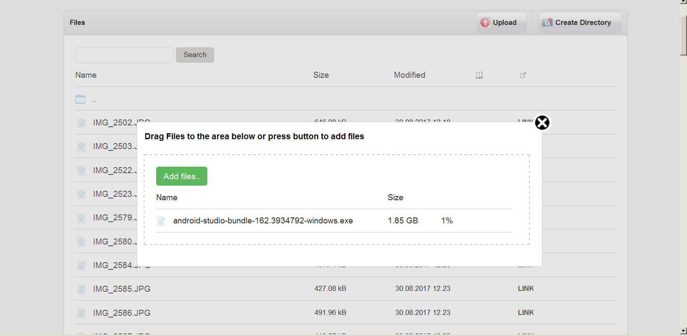

Riak CS Middleware
==================

This is a Cowboy web application that you can put in front of Riak CS instances.

Raison d'etre
=============

1. Authentication
2. HTTP/2 support
3. Transliterate UTF8 in object names to make URLs readable
4. It provides RPC for uploading chunks of data
5. It provides a nice web interface for managing object storage contents
6. It generates index.html listing of pseudo-directories

Planned:
7. Audit log

How it works
============

When user uploads file, middleware does the following.

1. It queries Keystone to check user's token
2. If token is valid, it creates bucket with name "the-<user name>-<tenant name>-<bucket type>",
   where "user id" and "token id" are keystone user and token IDs and "bucket type"
   is one of "public" or "private".
3. It uploads file to Riak CS

When user calls API endpoint that lists objects, middleware checks token,
compares bucket name to Keystone user id and if match found, queries Riak CS
and returns list of objects.

This way you don't have to enable SSL in order to use Riak's authentication system.

It is assumed that users within one project ( "tenant" ),
can read each other files in public buckets.

Installation
==========
kerl build 19.2
kerl install R1902 ~/erlang/R1902

wget https://erlang.mk/erlang.mk
make
cd deps
git clone https://github.com/goj/base16.git
cd ..
make rel

Riak CS
=======
kerl build git git://github.com/basho/otp.git OTP_R16B02_basho8 R16B02-basho8
kerl install R16B02-basho8 ~/erlang/R16B02-basho8

Dependencies
============
* openssl

For building Riak:
* build-essential
* libc6-dev-i386
* libpam0g-dev

See also
========
[How to install Riak CS](/doc/riak_cs_setup.txt)

[How to update Solr scema](/doc/solr_setup.txt)
